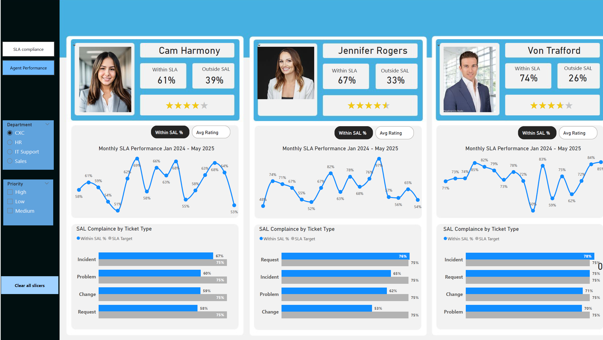

# 📊 Power BI SLA Performance Dashboard

## 🔍 Overview

This project is a Power BI dashboard designed to monitor and analyze **SLA (Service Level Agreement) compliance** across departments, countries, and ticket priorities. It helps stakeholders identify underperforming areas and track SLA performance over time.

---

## 🎯 Objectives

- Track ticket resolution against SLA targets
- Analyze SLA performance by:
  - **Priority**: High, Medium, Low
  - **Department**: HR, IT Support, CXC, Sales
  - **Country**: 10 different regions including France, Poland, and Sweden
  - **Ticket Type**: Incident, Request, Problem, Change
  - **Agent Performance**
- Monitor monthly trends from **January 2024 to May 2025**

---

## 📈 Key Features

- 📅 **Monthly SLA Trend Analysis**  
- 🚨 **Priority-wise SLA Violation Tracking**
- 🌍 **Country-wise SLA Compliance Overview**
- 👥 **Departmental Breakdown**
- 🧑‍💻 **Agent-wise SLA & Rating Insights**
- 🗂️ **Ticket Type SLA Performance**

---

## 📌 SLA Highlights

| Category          | Total Tickets | SLA Target | Within SLA | Compliance Rate |
|------------------|---------------|------------|------------|-----------------|
| Overall           | 125           | 75%        | 97         | 78%             |
| High Priority     | 26            | 75%        | 26         | 100% ✅         |
| Medium Priority   | 41            | 75%        | 68         | 60.29% ❌       |
| Low Priority      | 30            | 75%        | 31         | 96.77% ✅       |

---

## 🌍 Country-Wise SLA Performance

Out of 10 countries, **7 met** the SLA target. Some examples:

| Country     | Tickets | Within SLA | Compliance |
|-------------|---------|------------|------------|
| Netherlands | 16      | 14         | 88% ✅     |
| Poland      | 19      | 16         | 84% ✅     |
| France      | 12      | 10         | 83% ✅     |
| Austria     | 8       | 5          | 63% ❌     |

---

## 🧾 SLA by Ticket Type

| Ticket Type | Within SLA | SLA Target |
|-------------|------------|------------|
| Request     | 76%        | 75% ✅     |
| Incident    | 65%        | 75% ❌     |
| Problem     | 62%        | 75% ❌     |
| Change      | 53%        | 75% ❌     |

---

## 👨‍💼 Agent Performance (Sample)

| Agent            | SLA Compliance | Avg Rating         |
|------------------|----------------|--------------------|
| Cam Harmony      | 61%            | ★★★★★★★★☆☆       |
| Jennifer Rogers  | 67%            | ★★★★★★★★★★       |
| Von Trafford     | 74%            | ★★★★★★★★★☆       |

---

## 🛠️ Tools Used

- [Power BI Desktop](https://powerbi.microsoft.com/)
- Internal ticketing data sources
- Manual and automated data loading

---

